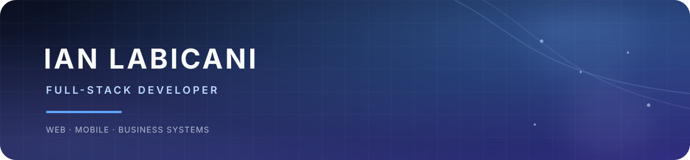

  

<h1 align="center">Hi, I'm Ian Labicani</h1>

  Full-stack developer building practical web, mobile, and business systems.

  <a href="https://shipwithian.online">Portfolio</a> ·
  <a href="https://shipwithian.online/projects">Projects</a> ·
  <a href="https://shipwithian.online/blog">Engineering blog</a> ·
  <a href="https://linkedin.com/in/ianlabicani">LinkedIn</a>

I build practical software for real workflows—from CRM/ERP operations and education systems to offline-first mobile tools. I enjoy working across backend architecture, data modeling, product workflows, and the interfaces that make those systems easier to use.

## Technical focus

**Backend** · PHP · Laravel · REST APIs · authorization · workflow design

  <picture>
    <source media="(prefers-color-scheme: dark)" srcset="https://skillicons.dev/icons?i=php%2Claravel&amp;theme=dark" />
    <source media="(prefers-color-scheme: light)" srcset="https://skillicons.dev/icons?i=php%2Claravel&amp;theme=light" />
    
  </picture>

**Frontend** · React · Inertia.js · TypeScript · Tailwind CSS

  <picture>
    <source media="(prefers-color-scheme: dark)" srcset="https://skillicons.dev/icons?i=react%2Ctypescript%2Ctailwind&amp;theme=dark" />
    <source media="(prefers-color-scheme: light)" srcset="https://skillicons.dev/icons?i=react%2Ctypescript%2Ctailwind&amp;theme=light" />
    
  </picture>

**Data and infrastructure** · PostgreSQL · PostGIS · SQLite · Docker

  <picture>
    <source media="(prefers-color-scheme: dark)" srcset="https://skillicons.dev/icons?i=postgres%2Csqlite%2Cdocker&amp;theme=dark" />
    <source media="(prefers-color-scheme: light)" srcset="https://skillicons.dev/icons?i=postgres%2Csqlite%2Cdocker&amp;theme=light" />
    
  </picture>

**Mobile** · Flutter · Dart

  <picture>
    <source media="(prefers-color-scheme: dark)" srcset="https://skillicons.dev/icons?i=flutter%2Cdart&amp;theme=dark" />
    <source media="(prefers-color-scheme: light)" srcset="https://skillicons.dev/icons?i=flutter%2Cdart&amp;theme=light" />
    
  </picture>

## Selected work

- **[ShipWithIan](https://shipwithian.online)** — A portfolio and operations platform that has grown into a CRM/ERP-style system for managing clients, leads, projects, services, inquiries, and internal workflows.

- **[ClassSync](https://shipwithian.online/projects/classsync)** — A classroom operations platform focused on grading, class management, and academic workflows. It includes PayMongo-backed pricing and payment flows, role-based access, and TeachAssist, an AI teacher assistant.

- **[Barya](https://shipwithian.online/projects/barya)** — A local-first Flutter personal finance app for tracking accounts, income, expenses, transfers, and budgets with SQLite storage, backup and export tools, and Android widgets.

- **[Fisheries CIS](https://shipwithian.online/projects/fisheries-cis)** — A climate and fisheries information system that presents field updates, maps, alerts, and advisories using external data and APIs.

## Open source

- **[ShipKit](https://github.com/shipwithian/shipkit)** — An opinionated Laravel and React starter application for building new products on a production-minded foundation.

- **[geoph-lite](https://github.com/ianlabicani/geoph-lite)** — Lightweight Philippine geographic data based on the Philippine Standard Geographic Code for Node.js and modern frontend applications.

## Contribution activity

  <picture>
    <source media="(prefers-color-scheme: dark)" srcset="https://raw.githubusercontent.com/ianlabicani/ianlabicani/output/github-contribution-grid-snake-dark.svg" />
    <source media="(prefers-color-scheme: light)" srcset="https://raw.githubusercontent.com/ianlabicani/ianlabicani/output/github-contribution-grid-snake.svg" />
    
  </picture>

  <a href="https://github.com/ianlabicani">GitHub</a> ·
  <a href="https://shipwithian.online">Portfolio</a> ·
  <a href="https://linkedin.com/in/ianlabicani">LinkedIn</a>

